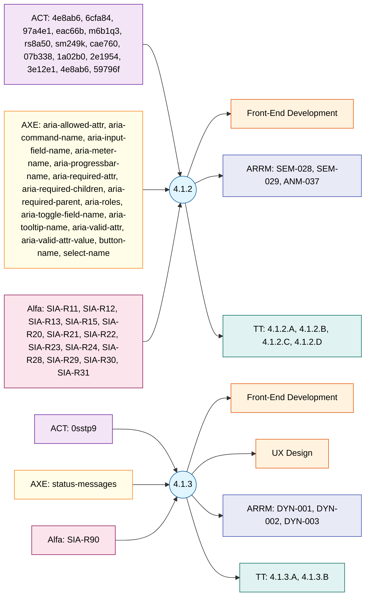

# WCAG 2.2 Principle 4: Robust – Roles & Testing

Success Criteria 4.x.x (2 SCs).

SC nodes form a **vertical spine** running top to bottom in the centre.
Automated testing tools (ACT, AXE, Alfa) branch off to the **left** of each SC.
Responsible roles branch off to the **right** of each SC.
ARRM task IDs and Trusted Tester steps branch off from each SC node.
(`graph LR` is used so that root SC nodes stack vertically, not horizontally.)

**Legend**

| Colour | Meaning |
|--------|---------|
| 🔵 Blue | Success Criterion |
| 🟠 Orange | Responsible Role |
| 🟣 Purple | ACT Automated Rules |
| 🟡 Yellow | AXE Automated Rules |
| 🩷 Pink | Alfa Automated Rules |
| 🟦 Indigo | ARRM Task IDs |
| 🟩 Teal | Trusted Tester v5 |

