# WCAG 2.2 Success Criteria – Roles & Testing

SC nodes form a **vertical spine** running top to bottom in the centre.
Automated testing tools (ACT, AXE, Alfa) branch off to the **left** of each SC.
Responsible roles branch off to the **right** of each SC.
(`graph LR` is used so that root SC nodes stack vertically, not horizontally.)

**Legend**

| Colour | Meaning |
|--------|---------|
| 🔵 Blue | Success Criterion |
| 🟠 Orange | Responsible Role |
| 🟣 Purple | ACT Automated Rules |
| 🟡 Yellow | AXE Automated Rules |
| 🩷 Pink | Alfa Automated Rules |

```mermaid
graph LR
    classDef sc   fill:#e1f5fe,stroke:#01579b,color:#000
    classDef role fill:#fff3e0,stroke:#e65100,color:#000
    classDef act  fill:#f3e5f5,stroke:#6a1b9a,color:#000
    classDef axe  fill:#fffde7,stroke:#f57f17,color:#000
    classDef alfa fill:#fce4ec,stroke:#880e4f,color:#000

    N1_1_1((1.1.1)):::sc
    A_act_1_1_1["ACT: 23a2a8, 3ea0c8, 59796f, 9eb3f6, a25f45, c3232f, de46e4"]:::act --> N1_1_1
    A_axe_1_1_1["AXE: area-alt, image-alt, input-image-alt, object-alt, role-img-alt, svg-img-alt, input-button-name"]:::axe --> N1_1_1
    A_alfa_1_1_1["Alfa: SIA-R2, SIA-R3, SIA-R25, SIA-R26, SIA-R41"]:::alfa --> N1_1_1
    N1_1_1 --> R1_1_1_CA[Content Authoring]:::role
    N1_1_1 --> R1_1_1_UX[User Experience Design]:::role
    N1_1_1 --> R1_1_1_FE[Front-End Development]:::role

    N1_2_1((1.2.1)):::sc
    N1_2_1 --> R1_2_1_CA[Content Authoring]:::role
    N1_2_1 --> R1_2_1_UX[User Experience Design]:::role

    N1_2_2((1.2.2)):::sc
    A_act_1_2_2["ACT: eac66b"]:::act --> N1_2_2
    A_axe_1_2_2["AXE: video-caption"]:::axe --> N1_2_2
    N1_2_2 --> R1_2_2_CA[Content Authoring]:::role

    N1_2_3((1.2.3)):::sc
    N1_2_3 --> R1_2_3_CA[Content Authoring]:::role

    N1_2_4((1.2.4)):::sc
    N1_2_4 --> R1_2_4_CA[Content Authoring]:::role

    N1_2_5((1.2.5)):::sc
    N1_2_5 --> R1_2_5_CA[Content Authoring]:::role

    N1_2_6((1.2.6)):::sc
    N1_2_6 --> R1_2_6_CA[Content Authoring]:::role

    N1_2_7((1.2.7)):::sc
    N1_2_7 --> R1_2_7_CA[Content Authoring]:::role

    N1_2_8((1.2.8)):::sc
    N1_2_8 --> R1_2_8_CA[Content Authoring]:::role

    N1_2_9((1.2.9)):::sc
    N1_2_9 --> R1_2_9_CA[Content Authoring]:::role

    N1_3_1((1.3.1)):::sc
    A_act_1_3_1["ACT: 307n5z, 3e12e1, 674b10, 78fd32, 7d6734, b49b2e, d0f69e, d9e9d9, eba20a, f51b46"]:::act --> N1_3_1
    A_axe_1_3_1["AXE: definition-list, dlitem, list, listitem, landmark-one-main, table-duplicate-name, td-headers-attr, th-has-data-cells"]:::axe --> N1_3_1
    A_alfa_1_3_1["Alfa: SIA-R1, SIA-R4, SIA-R7, SIA-R13, SIA-R16, SIA-R39, SIA-R53"]:::alfa --> N1_3_1
    N1_3_1 --> R1_3_1_CA[Content Authoring]:::role
    N1_3_1 --> R1_3_1_UX[User Experience Design]:::role
    N1_3_1 --> R1_3_1_FE[Front-End Development]:::role

    N1_3_2((1.3.2)):::sc
    N1_3_2 --> R1_3_2_UX[User Experience Design]:::role
    N1_3_2 --> R1_3_2_FE[Front-End Development]:::role

    N1_3_3((1.3.3)):::sc
    N1_3_3 --> R1_3_3_CA[Content Authoring]:::role
    N1_3_3 --> R1_3_3_UX[User Experience Design]:::role

    N1_3_4((1.3.4)):::sc
    A_act_1_3_4["ACT: b33eff"]:::act --> N1_3_4
    A_axe_1_3_4["AXE: css-orientation-lock"]:::axe --> N1_3_4
    A_alfa_1_3_4["Alfa: SIA-R9"]:::alfa --> N1_3_4
    N1_3_4 --> R1_3_4_UX[User Experience Design]:::role
    N1_3_4 --> R1_3_4_FE[Front-End Development]:::role

    N1_3_5((1.3.5)):::sc
    A_act_1_3_5["ACT: 135hje"]:::act --> N1_3_5
    A_axe_1_3_5["AXE: autocomplete-valid"]:::axe --> N1_3_5
    A_alfa_1_3_5["Alfa: SIA-R8"]:::alfa --> N1_3_5
    N1_3_5 --> R1_3_5_FE[Front-End Development]:::role

    N1_3_6((1.3.6)):::sc
    N1_3_6 --> R1_3_6_UX[User Experience Design]:::role
    N1_3_6 --> R1_3_6_FE[Front-End Development]:::role

    N1_4_1((1.4.1)):::sc
    N1_4_1 --> R1_4_1_CA[Content Authoring]:::role
    N1_4_1 --> R1_4_1_VD[Visual Design]:::role

    N1_4_2((1.4.2)):::sc
    N1_4_2 --> R1_4_2_UX[User Experience Design]:::role
    N1_4_2 --> R1_4_2_FE[Front-End Development]:::role

    N1_4_3((1.4.3)):::sc
    A_act_1_4_3["ACT: 09o5cg, afw4f7"]:::act --> N1_4_3
    A_axe_1_4_3["AXE: color-contrast"]:::axe --> N1_4_3
    A_alfa_1_4_3["Alfa: SIA-R69"]:::alfa --> N1_4_3
    N1_4_3 --> R1_4_3_VD[Visual Design]:::role

    N1_4_4((1.4.4)):::sc
    A_axe_1_4_4["AXE: meta-viewport"]:::axe --> N1_4_4
    N1_4_4 --> R1_4_4_VD[Visual Design]:::role
    N1_4_4 --> R1_4_4_FE[Front-End Development]:::role

    N1_4_5((1.4.5)):::sc
    N1_4_5 --> R1_4_5_CA[Content Authoring]:::role
    N1_4_5 --> R1_4_5_VD[Visual Design]:::role

    N1_4_6((1.4.6)):::sc
    A_axe_1_4_6["AXE: color-contrast-enhanced"]:::axe --> N1_4_6
    N1_4_6 --> R1_4_6_VD[Visual Design]:::role

    N1_4_7((1.4.7)):::sc
    N1_4_7 --> R1_4_7_CA[Content Authoring]:::role

    N1_4_8((1.4.8)):::sc
    N1_4_8 --> R1_4_8_VD[Visual Design]:::role
    N1_4_8 --> R1_4_8_FE[Front-End Development]:::role

    N1_4_9((1.4.9)):::sc
    N1_4_9 --> R1_4_9_VD[Visual Design]:::role

    N1_4_10((1.4.10)):::sc
    N1_4_10 --> R1_4_10_VD[Visual Design]:::role
    N1_4_10 --> R1_4_10_FE[Front-End Development]:::role

    N1_4_11((1.4.11)):::sc
    A_act_1_4_11["ACT: 4c31df"]:::act --> N1_4_11
    A_axe_1_4_11["AXE: non-text-color-contrast"]:::axe --> N1_4_11
    A_alfa_1_4_11["Alfa: SIA-R70"]:::alfa --> N1_4_11
    N1_4_11 --> R1_4_11_VD[Visual Design]:::role

    N1_4_12((1.4.12)):::sc
    A_act_1_4_12["ACT: 9e45ec"]:::act --> N1_4_12
    A_alfa_1_4_12["Alfa: SIA-R86"]:::alfa --> N1_4_12
    N1_4_12 --> R1_4_12_VD[Visual Design]:::role
    N1_4_12 --> R1_4_12_FE[Front-End Development]:::role

    N1_4_13((1.4.13)):::sc
    N1_4_13 --> R1_4_13_UX[User Experience Design]:::role
    N1_4_13 --> R1_4_13_FE[Front-End Development]:::role

    N2_1_1((2.1.1)):::sc
    N2_1_1 --> R2_1_1_UX[User Experience Design]:::role
    N2_1_1 --> R2_1_1_FE[Front-End Development]:::role

    N2_1_2((2.1.2)):::sc
    N2_1_2 --> R2_1_2_FE[Front-End Development]:::role

    N2_1_3((2.1.3)):::sc
    N2_1_3 --> R2_1_3_FE[Front-End Development]:::role

    N2_1_4((2.1.4)):::sc
    N2_1_4 --> R2_1_4_UX[User Experience Design]:::role
    N2_1_4 --> R2_1_4_FE[Front-End Development]:::role

    N2_2_1((2.2.1)):::sc
    N2_2_1 --> R2_2_1_UX[User Experience Design]:::role
    N2_2_1 --> R2_2_1_FE[Front-End Development]:::role

    N2_2_2((2.2.2)):::sc
    N2_2_2 --> R2_2_2_UX[User Experience Design]:::role
    N2_2_2 --> R2_2_2_FE[Front-End Development]:::role

    N2_2_3((2.2.3)):::sc
    N2_2_3 --> R2_2_3_B[Business]:::role
    N2_2_3 --> R2_2_3_UX[User Experience Design]:::role

    N2_2_4((2.2.4)):::sc
    N2_2_4 --> R2_2_4_UX[User Experience Design]:::role

    N2_2_5((2.2.5)):::sc
    N2_2_5 --> R2_2_5_B[Business]:::role
    N2_2_5 --> R2_2_5_FE[Front-End Development]:::role

    N2_2_6((2.2.6)):::sc
    N2_2_6 --> R2_2_6_B[Business]:::role
    N2_2_6 --> R2_2_6_UX[User Experience Design]:::role

    N2_3_1((2.3.1)):::sc
    N2_3_1 --> R2_3_1_CA[Content Authoring]:::role
    N2_3_1 --> R2_3_1_VD[Visual Design]:::role

    N2_3_2((2.3.2)):::sc
    N2_3_2 --> R2_3_2_CA[Content Authoring]:::role

    N2_3_3((2.3.3)):::sc
    N2_3_3 --> R2_3_3_UX[User Experience Design]:::role
    N2_3_3 --> R2_3_3_FE[Front-End Development]:::role

    N2_4_1((2.4.1)):::sc
    A_act_2_4_1["ACT: 3e11da"]:::act --> N2_4_1
    A_axe_2_4_1["AXE: bypass"]:::axe --> N2_4_1
    A_alfa_2_4_1["Alfa: SIA-R87"]:::alfa --> N2_4_1
    N2_4_1 --> R2_4_1_FE[Front-End Development]:::role

    N2_4_2((2.4.2)):::sc
    A_act_2_4_2["ACT: 2779a5"]:::act --> N2_4_2
    A_axe_2_4_2["AXE: document-title"]:::axe --> N2_4_2
    A_alfa_2_4_2["Alfa: SIA-R1"]:::alfa --> N2_4_2
    N2_4_2 --> R2_4_2_CA[Content Authoring]:::role
    N2_4_2 --> R2_4_2_FE[Front-End Development]:::role

    N2_4_3((2.4.3)):::sc
    N2_4_3 --> R2_4_3_UX[User Experience Design]:::role
    N2_4_3 --> R2_4_3_FE[Front-End Development]:::role

    N2_4_4((2.4.4)):::sc
    A_act_2_4_4["ACT: c487ae"]:::act --> N2_4_4
    A_axe_2_4_4["AXE: link-name"]:::axe --> N2_4_4
    A_alfa_2_4_4["Alfa: SIA-R10"]:::alfa --> N2_4_4
    N2_4_4 --> R2_4_4_CA[Content Authoring]:::role
    N2_4_4 --> R2_4_4_FE[Front-End Development]:::role

    N2_4_5((2.4.5)):::sc
    N2_4_5 --> R2_4_5_B[Business]:::role
    N2_4_5 --> R2_4_5_UX[User Experience Design]:::role

    N2_4_6((2.4.6)):::sc
    N2_4_6 --> R2_4_6_CA[Content Authoring]:::role
    N2_4_6 --> R2_4_6_FE[Front-End Development]:::role

    N2_4_7((2.4.7)):::sc
    N2_4_7 --> R2_4_7_VD[Visual Design]:::role
    N2_4_7 --> R2_4_7_FE[Front-End Development]:::role

    N2_4_8((2.4.8)):::sc
    N2_4_8 --> R2_4_8_CA[Content Authoring]:::role
    N2_4_8 --> R2_4_8_UX[User Experience Design]:::role

    N2_4_9((2.4.9)):::sc
    N2_4_9 --> R2_4_9_CA[Content Authoring]:::role

    N2_4_10((2.4.10)):::sc
    N2_4_10 --> R2_4_10_CA[Content Authoring]:::role

    N2_4_11((2.4.11)):::sc
    A_act_2_4_11["ACT: 04639e"]:::act --> N2_4_11
    A_axe_2_4_11["AXE: focus-not-obscured"]:::axe --> N2_4_11
    A_alfa_2_4_11["Alfa: SIA-R109"]:::alfa --> N2_4_11
    N2_4_11 --> R2_4_11_UX[User Experience Design]:::role
    N2_4_11 --> R2_4_11_FE[Front-End Development]:::role

    N2_4_12((2.4.12)):::sc
    N2_4_12 --> R2_4_12_VD[Visual Design]:::role
    N2_4_12 --> R2_4_12_UX[User Experience Design]:::role

    N2_4_13((2.4.13)):::sc
    A_act_2_4_13["ACT: 674b10"]:::act --> N2_4_13
    A_axe_2_4_13["AXE: focus-appearance"]:::axe --> N2_4_13
    A_alfa_2_4_13["Alfa: SIA-R110"]:::alfa --> N2_4_13
    N2_4_13 --> R2_4_13_VD[Visual Design]:::role

    N2_5_1((2.5.1)):::sc
    N2_5_1 --> R2_5_1_UX[User Experience Design]:::role
    N2_5_1 --> R2_5_1_FE[Front-End Development]:::role

    N2_5_2((2.5.2)):::sc
    N2_5_2 --> R2_5_2_FE[Front-End Development]:::role

    N2_5_3((2.5.3)):::sc
    A_act_2_5_3["ACT: 2ee8b8"]:::act --> N2_5_3
    A_axe_2_5_3["AXE: label-content-name-mismatch"]:::axe --> N2_5_3
    A_alfa_2_5_3["Alfa: SIA-R14"]:::alfa --> N2_5_3
    N2_5_3 --> R2_5_3_CA[Content Authoring]:::role
    N2_5_3 --> R2_5_3_FE[Front-End Development]:::role

    N2_5_4((2.5.4)):::sc
    N2_5_4 --> R2_5_4_UX[User Experience Design]:::role
    N2_5_4 --> R2_5_4_FE[Front-End Development]:::role

    N2_5_5((2.5.5)):::sc
    N2_5_5 --> R2_5_5_VD[Visual Design]:::role
    N2_5_5 --> R2_5_5_FE[Front-End Development]:::role

    N2_5_6((2.5.6)):::sc
    N2_5_6 --> R2_5_6_FE[Front-End Development]:::role

    N2_5_7((2.5.7)):::sc
    A_axe_2_5_7["AXE: dragging-movements"]:::axe --> N2_5_7
    N2_5_7 --> R2_5_7_UX[User Experience Design]:::role
    N2_5_7 --> R2_5_7_FE[Front-End Development]:::role

    N2_5_8((2.5.8)):::sc
    A_act_2_5_8["ACT: a25f45"]:::act --> N2_5_8
    A_axe_2_5_8["AXE: target-size"]:::axe --> N2_5_8
    A_alfa_2_5_8["Alfa: SIA-R101"]:::alfa --> N2_5_8
    N2_5_8 --> R2_5_8_VD[Visual Design]:::role

    N3_1_1((3.1.1)):::sc
    A_act_3_1_1["ACT: bf051a"]:::act --> N3_1_1
    A_axe_3_1_1["AXE: html-has-lang, html-lang-valid"]:::axe --> N3_1_1
    A_alfa_3_1_1["Alfa: SIA-R4"]:::alfa --> N3_1_1
    N3_1_1 --> R3_1_1_CA[Content Authoring]:::role
    N3_1_1 --> R3_1_1_FE[Front-End Development]:::role

    N3_1_2((3.1.2)):::sc
    A_act_3_1_2["ACT: de46e4"]:::act --> N3_1_2
    A_axe_3_1_2["AXE: valid-lang"]:::axe --> N3_1_2
    A_alfa_3_1_2["Alfa: SIA-R5"]:::alfa --> N3_1_2
    N3_1_2 --> R3_1_2_CA[Content Authoring]:::role
    N3_1_2 --> R3_1_2_FE[Front-End Development]:::role

    N3_1_3((3.1.3)):::sc
    N3_1_3 --> R3_1_3_CA[Content Authoring]:::role

    N3_1_4((3.1.4)):::sc
    N3_1_4 --> R3_1_4_CA[Content Authoring]:::role

    N3_1_5((3.1.5)):::sc
    N3_1_5 --> R3_1_5_CA[Content Authoring]:::role

    N3_1_6((3.1.6)):::sc
    N3_1_6 --> R3_1_6_CA[Content Authoring]:::role

    N3_2_1((3.2.1)):::sc
    N3_2_1 --> R3_2_1_FE[Front-End Development]:::role

    N3_2_2((3.2.2)):::sc
    N3_2_2 --> R3_2_2_UX[User Experience Design]:::role
    N3_2_2 --> R3_2_2_FE[Front-End Development]:::role

    N3_2_3((3.2.3)):::sc
    N3_2_3 --> R3_2_3_UX[User Experience Design]:::role
    N3_2_3 --> R3_2_3_FE[Front-End Development]:::role

    N3_2_4((3.2.4)):::sc
    N3_2_4 --> R3_2_4_CA[Content Authoring]:::role
    N3_2_4 --> R3_2_4_UX[User Experience Design]:::role

    N3_2_5((3.2.5)):::sc
    N3_2_5 --> R3_2_5_UX[User Experience Design]:::role
    N3_2_5 --> R3_2_5_FE[Front-End Development]:::role

    N3_2_6((3.2.6)):::sc
    A_act_3_2_6["ACT: 30b328"]:::act --> N3_2_6
    N3_2_6 --> R3_2_6_B[Business]:::role
    N3_2_6 --> R3_2_6_CA[Content Authoring]:::role

    N3_3_1((3.3.1)):::sc
    N3_3_1 --> R3_3_1_UX[User Experience Design]:::role
    N3_3_1 --> R3_3_1_FE[Front-End Development]:::role

    N3_3_2((3.3.2)):::sc
    N3_3_2 --> R3_3_2_CA[Content Authoring]:::role
    N3_3_2 --> R3_3_2_UX[User Experience Design]:::role

    N3_3_3((3.3.3)):::sc
    N3_3_3 --> R3_3_3_CA[Content Authoring]:::role
    N3_3_3 --> R3_3_3_UX[User Experience Design]:::role

    N3_3_4((3.3.4)):::sc
    N3_3_4 --> R3_3_4_B[Business]:::role
    N3_3_4 --> R3_3_4_UX[User Experience Design]:::role

    N3_3_5((3.3.5)):::sc
    N3_3_5 --> R3_3_5_CA[Content Authoring]:::role
    N3_3_5 --> R3_3_5_UX[User Experience Design]:::role

    N3_3_6((3.3.6)):::sc
    N3_3_6 --> R3_3_6_B[Business]:::role
    N3_3_6 --> R3_3_6_UX[User Experience Design]:::role

    N3_3_7((3.3.7)):::sc
    A_axe_3_3_7["AXE: no-redundant-entry"]:::axe --> N3_3_7
    N3_3_7 --> R3_3_7_UX[User Experience Design]:::role
    N3_3_7 --> R3_3_7_FE[Front-End Development]:::role

    N3_3_8((3.3.8)):::sc
    N3_3_8 --> R3_3_8_B[Business]:::role
    N3_3_8 --> R3_3_8_UX[User Experience Design]:::role

    N3_3_9((3.3.9)):::sc
    N3_3_9 --> R3_3_9_B[Business]:::role

    N4_1_2((4.1.2)):::sc
    A_act_4_1_2["ACT: 4e8ab6, 6cfa84, 97a4e1, eac66b, m6b1q3, rs8a50, sm249k, cae760, 07b338, 1a02b0, 2e1954, 3e12e1, 4e8ab6, 59796f"]:::act --> N4_1_2
    A_axe_4_1_2["AXE: aria-allowed-attr, aria-command-name, aria-input-field-name, aria-meter-name, aria-progressbar-name, aria-required-attr, aria-required-children, aria-required-parent, aria-roles, aria-toggle-field-name, aria-tooltip-name, aria-valid-attr, aria-valid-attr-value, button-name, select-name"]:::axe --> N4_1_2
    A_alfa_4_1_2["Alfa: SIA-R11, SIA-R12, SIA-R13, SIA-R15, SIA-R20, SIA-R21, SIA-R22, SIA-R23, SIA-R24, SIA-R28, SIA-R29, SIA-R30, SIA-R31"]:::alfa --> N4_1_2
    N4_1_2 --> R4_1_2_FE[Front-End Development]:::role

    N4_1_3((4.1.3)):::sc
    A_act_4_1_3["ACT: 0sstp9"]:::act --> N4_1_3
    A_axe_4_1_3["AXE: status-messages"]:::axe --> N4_1_3
    A_alfa_4_1_3["Alfa: SIA-R90"]:::alfa --> N4_1_3
    N4_1_3 --> R4_1_3_UX[User Experience Design]:::role
    N4_1_3 --> R4_1_3_FE[Front-End Development]:::role
```

